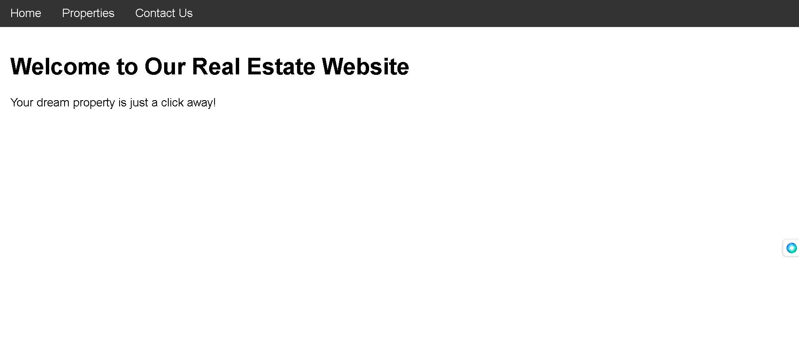
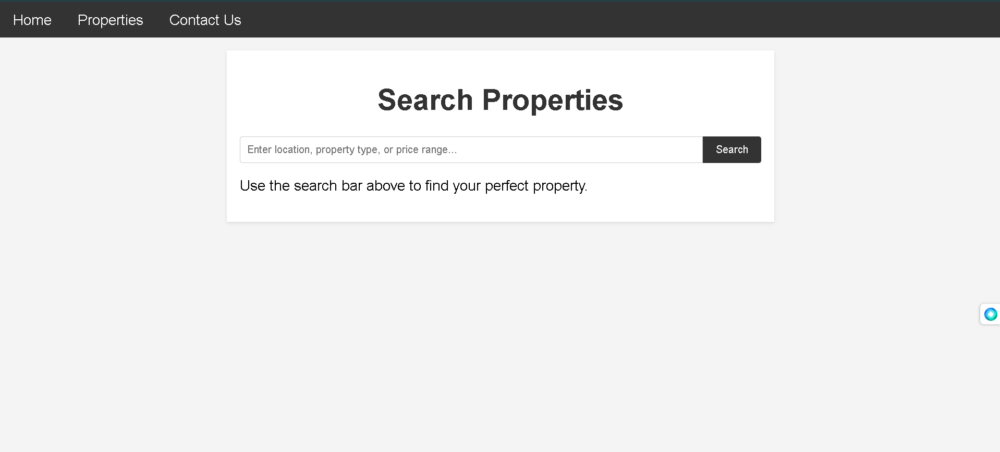
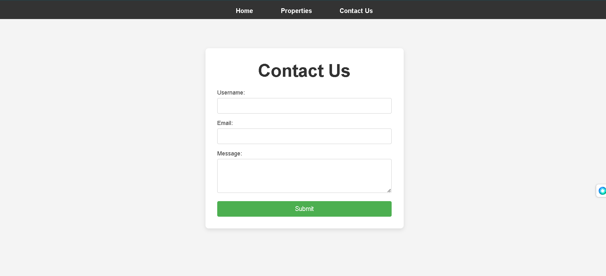

# Go Language Fundamentals

Welcome to the Go Language Fundamentals repository. This repository is designed to provide a comprehensive overview of the Go programming language, covering essential topics and best practices.

## Table of Contents

- [Introduction](#introduction)
- [Basic Topics](#basic-topics)
  - [Variables and Constants](#variables-and-constants)
  - [Data Types](#data-types)
  - [Control Structures](#control-structures)
  - [Functions](#functions)
  - [Packages](#packages)
  - [Error Handling](#error-handling)
  - [Structs and Interfaces](#structs-and-interfaces)
  - [Concurrency](#concurrency)
  - [Testing](#testing)
  - [Modules and Dependency Management](#modules-and-dependency-management)
  - [Standard Library Overview](#standard-library-overview)
  - [Tools and Best Practices](#tools-and-best-practices)

## Introduction

This repository was created to share the fundamentals of the Go programming language, also known as Golang. Whether you are a beginner or an experienced developer, this guide will help you understand the core concepts and features of Go.

## Basic Topics

### Variables and Constants
Learn how to declare and initialize variables and constants in Go.

### Data Types
Understand the different data types available in Go, including strings, integers, and floating-point numbers.

### Control Structures
Explore the various control structures in Go, such as `if`, `for`, and `switch` statements.

### Functions
Discover how to define and use functions in Go.

### Packages
Learn about Go's package system and how to organize your code.

### Error Handling
Understand Go's approach to error handling and how to manage errors effectively.

### Structs and Interfaces
Explore Go's powerful type system with structs and interfaces.

### Concurrency
Dive into Go's concurrency model with goroutines and channels.

### Testing
Learn how to write and run tests in Go.

### Modules and Dependency Management
Understand how to manage dependencies and modules in Go.

### Standard Library Overview
Get an overview of Go's standard library and its key packages.

### Tools and Best Practices
Discover essential tools and best practices for Go development.

## Screenshots

